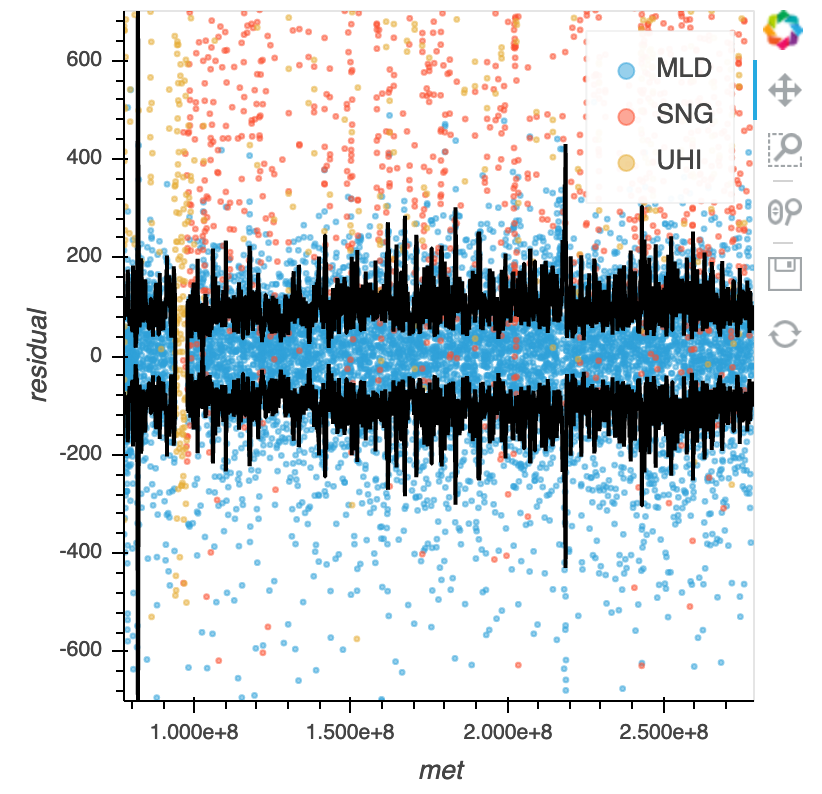

Utilities for a precise timing calibration of NuSTAR data
---------------------------------------------------------

.. image:: http://img.shields.io/badge/powered%20by-AstroPy-orange.svg?style=flat
    :target: http://www.astropy.org
    :alt: Powered by Astropy Badge

.. image:: https://travis-ci.com/matteobachetti/nustar-clock-utils.svg?token=rstW8i2PFzp3kAXcymsp&branch=master
    :target: https://travis-ci.com/matteobachetti/nustar-clock-utils
    :alt: Travis CI build

 Utilities for a precise timing calibration of NuSTAR data

Installation
------------

.. code-block::

    $ git clone https://github.com/matteobachetti/nustar-clock-utils
    $ cd nustar-clock-utils
    $ pip install -r requirements.txt
    $ pip install .

Usage
-----

To create a clock file
~~~~~~~~~~~~~~~~~~~~~~
Pass the temperature table, the clock offset table, the frequency change table, and give an output file name:

.. code-block ::

    $ nustar_clockfile tp_eps_ceu_txco_tmp.csv nustar_clock_offsets-2018-10-30.dat Craig/nustar_freq_changes-2018-12-06_corr.dat -o nuCclock20100101v099.fits.gz

This will produce the wanted clock file and a diagnostic plot showing the scatter of clock offsets around the temperature correction, e.g.

To correct a single event file (deprecated)
~~~~~~~~~~~~~~~~~~~~~~~~~~~~~~~~~~~~~~~~~~~
You should have at least a (non-barycentered) event file and some temperature information.
The latter can be found in the engineering housekeeping file (``auxil/nuXXXXXXXXXX_eng.hk.gz``) in recent observations.
Otherwise the SOC can provide a comma-separated file with the temperature information.
There are two ways to correct the clock data, one for legacy data (<2018:10:01) and one for recent data.

Legacy:

.. code-block ::

    $ nustar_tempcorr event_file.evt

Recent-ish:

.. code-block ::

    $ nustar_tempcorr nu101010101010A01_cl.evt -t nu101010101010_eng.hk.gz

Very recent observation, before an update to the clock offset and clock divisor adjustment history:

.. code-block ::

    $ nustar_tempcorr nu101010101010A01_cl.evt -D 24000335 -t nu101010101010_eng.hk.gz --no-adjust

The -D option specifies the clock divisor (the frequency of the quartz oscillator in the spacecraft TCXO).
If unkown, give something around 24000300 and be aware that the clock will be stable but will run fast or slow.

To barycenter the corrected data, at the moment you need a tempo-format parameter file with at least the
name and the coordinates.

.. code-block ::

    $ nustar_barycorr nu101010101010A01_cl_tc.evt nu101010101010A.attorb.gz TEMPO_PARAMETER_FILE.par

License
-------

This project is Copyright (c) Matteo Bachetti and licensed under
the terms of the BSD 3-Clause license. This package is based upon
the `Astropy package template <https://github.com/astropy/package-template>`_
which is licensed under the BSD 3-clause licence. See the licenses folder for
more information.

